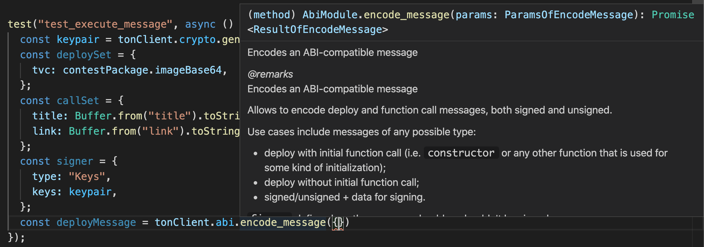
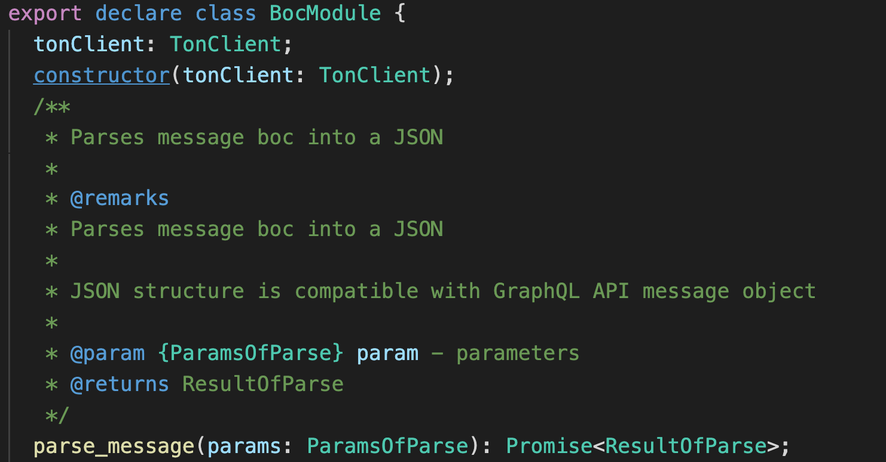

# ton-client-ts

**ton-client-ts** is a zero dependency cross-platform bindings for TON-SDK written in TypeScript. It can be used on both browser and node.js.

## Overview

- The library is fully typed
  
- Complete generated in-code documentation
  
- All binding units are covered with tests
- All functionality of TON-SDK v1.1.2 is fully supported
- The bindings interface is identical to the interface of the root library, nothing has been changed
- All calls are asynchronous
- Easy installation via platform-dependent npm packages

## How does it works?

Here is a mono-repository built with [lerna](https://github.com/lerna/lerna/projects "lerna") and [yarn workspaces](https://classic.yarnpkg.com/en/docs/workspaces/ "yarn workspaces") that includes the **core** **web** and **node** packages. The **core** package is a set of bindings, **web** and **node** packages provide the necessary library out of the box and are published as npm modules

The interface and class modules are generated from the api provided by the TON-SDK binary according to the current version

## Quick start

To start coding, first of all, add bindings library to your project.

**For node.js**
`npm install --save @ton-client-ts/node`

**For web**
`npm install --save @ton-client-ts/web`

You can also use bundles from `/packages/dist/main.js`

_Here and below there would be example for node.js. The usage of web package is the same._

Next, import TonClient from platform-depended lib

`import { TonClient } from '@ton-client-ts/node';`

Initialize client with [config](https://github.com/tonlabs/TON-SDK/blob/1b00b1a70351f9b2e651c08ff7205304f8c8f268/docs/mod_client.md#ClientConfig "config")

```
const tonClient = new TonClient({ network: { server_address: "net.ton.dev" } });
```

Enjoy using!

```
const { version } = await tonClient.client.version();
console.log(version) // -> 1.1.2
```

## Compatibility and support

**TON-SDK v1.1.2**

**nodejs**

- Windows x86_64
- Linux x64
- macOS x64

**web**

- Edge 86
- Firefox 82
- Google Chrome 86
- Safari 14

and more, check — https://caniuse.com/?search=wasm

## Example usage

#### Multisig deployment

```
  import { TonClient } from '@ton-client-ts/node';
  import { abi, tvc } from './multisig.package';

  const tonClient = new TonClient({ network: { server_address: "net.ton.dev" } });

  const deploySet = {
    tvc,
  };
  const callSet = {
    function_name: "constructor",
    input: {
      owners: [0x<public_key>],
      reqConfirms: 1,
    },
  };

  const signer = {
    type: "Keys",
    keys: { public: <public_key>, secret: <secret_key> },
  };

  try {
    await tonClient.abi.encode_message({
      abi: { type: "Contract", value: abi },
      signer,
      deploy_set: deploySet,
      call_set: callSet,
    });
	...
  } catch (err) {
    ...
  }
```

#### Generate keypair

```
  import { TonClient } from '@ton-client-ts/node';

  const tonClient = new TonClient({ network: { server_address: "net.ton.dev" } });

  const { public: publicKey, secret: secretKey } = await tonClient.crypto.generate_random_sign_keys();
```

#### Simple GraphQL collection request

```
  import { TonClient } from '@ton-client-ts/node';

  const tonClient = new TonClient({ network: { server_address: "net.ton.dev" } });

  const now = +(Date.now() / 1000).toFixed();

  const { result } = await tonClient.net.wait_for_collection({
    collection: "transactions",
    filter: {
      now: { gt: now },
    },
    result: "id now",
  });
```

#### Full TonClient lifecycle example

```
  import { TonClient } from '@ton-client-ts/node';

  const tonClient = new TonClient({ network: { server_address: "net.ton.dev" } })

  ...

  tonClient.destroy();

  // If you want to remove library hadler use this static method
  TonClient.deinit();
```

## Development, testing and building

> You have to use yarn to build and develop the library. This monorepo uses yarm workspaces to manage dependenices.

Install and link the dependencies at root directory
`yarn`

Then build packages
`yarn build`

> It will run `yarn generate` for modules generation All modules are generated by script in `./packages/core/src/generator/src/index.ts` from `api.json`. Then `yarn tcs` to build \*d.ts files and run `lerna run build:webpack --stream` to build packages bundles

Now library is ready to do some usefull stuff.

To run tests execute command
`yarn test`

To run web package in developer mode execute command
`yarn dev`

## Useful links

- [TON-SDK](https://github.com/tonlabs/TON-SDK "TON-SDK")
- [TON-SDK modules documentation](https://github.com/tonlabs/TON-SDK/blob/master/docs/modules.md "TON-SDK modules documentation")
- [TON-SDK JSON interface](https://github.com/tonlabs/TON-SDK/blob/master/docs/json_interface.md "TON-SDK JSON interface")

## File structure with build artifacts

```
├── README.md # Thats what you are reading right now ;)
├── babel.config.js
├── jest.config.base.js
├── jest.config.js
├── lerna.json
├── package.json
├── packages
│   ├── core # package with general bindings functionality
│   │   ├── dist
│   │   │   └── main.js # main built core entry
│   │   ├── generator # TON-SDK modules generator
│   │   │   ├── package-lock.json
│   │   │   ├── package.json
│   │   │   ├── src
│   │   │   │   ├── api-freeton-builder.ts
│   │   │   │   ├── api.json
│   │   │   │   ├── builders.ts
│   │   │   │   ├── index.ts
│   │   │   │   └── utils.ts
│   │   │   └── tsconfig.json
│   │   ├── package.json
│   │   ├── src
│   │   │   ├── errors.ts # TonClientError class defenition
│   │   │   ├── index.ts # core package dev entry point
│   │   │   ├── modules/ # generated TON-SDK modules
│   │   │   └── utils.module.ts # TON-SDK module extends
│   │   ├── tsclib/  # compiled TS
│   │   ├── tsconfig.json
│   │   ├── tsconfig.tsbuildinfo
│   │   └── types/ # package type defenitions
│   ├── node # package that provides correct binary for core and exports TonClient for node.js usage
│   │   ├── dist
│   │   │   ├── main.js # main built node entry
│   │   │   ├── tonclient-linux.node # node.js linux binary
│   │   │   ├── tonclient-mac.node # node.js mac binary
│   │   │   └── tonclient-win.node # node.js win binary
│   │   ├── jest.config.js
│   │   ├── jest.setup.js
│   │   ├── package.json
│   │   ├── src
│   │   │   ├── index.ts # node package dev entry point
│   │   │   ├── tonclient-linux.node # node.js linux binary
│   │   │   ├── tonclient-mac.node # node.js mac binary
│   │   │   └── tonclient-win.node # node.js win binary
│   │   ├── tests/ # bindings test-suites
│   │   ├── tsconfig.json
│   │   ├── tsconfig.tsbuildinfo
│   │   └── types/ # package type defenitions
│   └── web
│       ├── dist
│       │   ├── index.html # html is used for dev mode and web debugging
│       │   ├── main.js # main built web entry
│       │   └── tonclient.wasm # web binary
│       ├── package.json
│       ├── src
│       │   ├── index.ts # web package dev entry point
│       │   ├── load.js # wasm web-worker loader
│       │   └── tonclient.wasm # web binary
│       ├── tsconfig.json
│       ├── tsconfig.tsbuildinfo
│       └── types/ # package type defenitions
├── tsconfig.json
├── tsconfig.settings.json
├── webpack.config.node.js
├── webpack.config.web.dev.js
├── webpack.config.web.js
└── yarn.lock
```

## License

ton-client-ts is [Apache-2.0 licensed](http://www.apache.org/licenses/LICENSE-2.0 "Apache-2.0 licensed").
